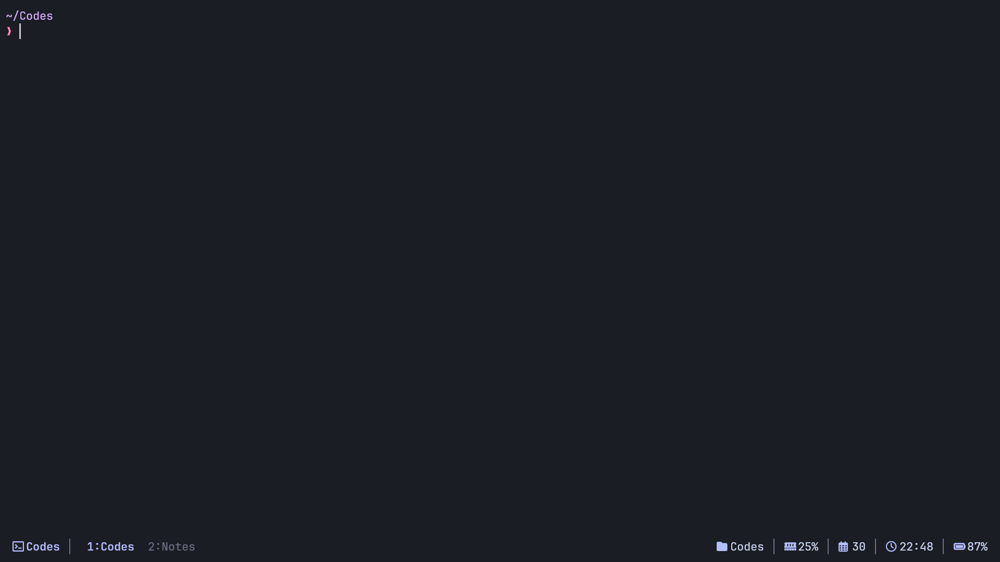

# 🎨 tmux-minimal-theme

> A clean, minimal, and highly customizable tmux theme with built-in system monitoring

[](https://opensource.org/licenses/MIT)
[](https://github.com/binoymanoj/tmux-minimal-theme/stargazers)
[](https://github.com/binoymanoj/tmux-minimal-theme/issues)

## Status Line


## Full


## ✨ Features

- 🎯 **Minimal Design** - Clean and distraction-free interface
- 📊 **System Monitoring** - Built-in CPU, memory, battery, and time display
- 🎨 **Highly Customizable** - Easy color and component customization
- 🌈 **Multiple Color Schemes** - Catppuccin, Tokyo Night, Dracula, Gruvbox
- ⚡ **Lightweight** - Fast and efficient with minimal resource usage
- 🔧 **Easy Installation** - One-line installation with TPM

## 📸 Screenshots

### Default Theme (Catppuccin Mocha)


<!-- ### Customization Examples -->
<!--  -->
<!---->
<!-- ### Features in Action -->
<!--  -->

## 🚀 Installation

### Prerequisites

- [tmux](https://github.com/tmux/tmux) (version 2.1 or higher)
- [TPM (Tmux Plugin Manager)](https://github.com/tmux-plugins/tpm)

### Using TPM (Recommended)

1. Add the plugin to your `~/.tmux.conf`:

```bash
set -g @plugin 'binoymanoj/tmux-minimal-theme'
```

2. Reload tmux configuration:

```bash
# Reload tmux config
tmux source-file ~/.tmux.conf
```

3. Install the plugin by pressing `prefix + I` (default prefix is `Ctrl-b`)

### Manual Installation

1. Clone the repository:

```bash
git clone https://github.com/binoymanoj/tmux-minimal-theme.git ~/.tmux/plugins/tmux-minimal-theme
```

2. Add to your `~/.tmux.conf`:

```bash
run-shell ~/.tmux/plugins/tmux-minimal-theme/minimal.tmux
```

3. Reload tmux configuration:

```bash
tmux source-file ~/.tmux.conf
```

## ⚙️ Configuration

### Basic Customization

You can customize the theme colors by adding these options to your `~/.tmux.conf`:

```bash
# Theme colors
set -g @minimal_theme_bg_color "#1A1D23"
set -g @minimal_theme_active_color "#b4befe"
set -g @minimal_theme_inactive_color "#6c7086"
set -g @minimal_theme_text_color "#cdd6f4"
set -g @minimal_theme_accent_color "#b4befe"
set -g @minimal_theme_border_color "#44475a"
```

### Pre-built Color Schemes

#### Catppuccin Mocha (Default)
```bash
# Already applied by default
```

#### Tokyo Night
```bash
set -g @minimal_theme_bg_color "#1a1b26"
set -g @minimal_theme_active_color "#7aa2f7"
set -g @minimal_theme_inactive_color "#565f89"
set -g @minimal_theme_text_color "#c0caf5"
set -g @minimal_theme_accent_color "#7aa2f7"
set -g @minimal_theme_border_color "#414868"
```

#### Dracula
```bash
set -g @minimal_theme_bg_color "#282a36"
set -g @minimal_theme_active_color "#bd93f9"
set -g @minimal_theme_inactive_color "#6272a4"
set -g @minimal_theme_text_color "#f8f8f2"
set -g @minimal_theme_accent_color "#bd93f9"
set -g @minimal_theme_border_color "#44475a"
```

#### Gruvbox Dark
```bash
set -g @minimal_theme_bg_color "#1d2021"
set -g @minimal_theme_active_color "#83a598"
set -g @minimal_theme_inactive_color "#665c54"
set -g @minimal_theme_text_color "#ebdbb2"
set -g @minimal_theme_accent_color "#83a598"
set -g @minimal_theme_border_color "#504945"
```

### Status Bar Components

The status bar displays the following information:

- **Left**: Session name with icon
- **Right**: Current directory, memory usage, date, time, battery percentage

## 🎨 Customization Guide

### Creating Your Own Color Scheme

1. Define your colors in `~/.tmux.conf`:

```bash
# Your custom theme
set -g @minimal_theme_bg_color "#your-bg-color"
set -g @minimal_theme_active_color "#your-active-color"
set -g @minimal_theme_inactive_color "#your-inactive-color"
set -g @minimal_theme_text_color "#your-text-color"
set -g @minimal_theme_accent_color "#your-accent-color"
set -g @minimal_theme_border_color "#your-border-color"
```

2. Reload tmux configuration:

```bash
tmux source-file ~/.tmux.conf
```

### Advanced Customization

For more advanced customization options, see [CUSTOMIZATION.md](docs/CUSTOMIZATION.md).

## 🔧 Troubleshooting

### Theme not loading

1. Ensure TPM is installed and working:

```bash
ls ~/.tmux/plugins/
```

2. Check if the plugin is listed:

```bash
tmux show-options -g | grep @plugin
```

3. Reload tmux configuration:

```bash
tmux source-file ~/.tmux.conf
```

### System information not showing

The theme requires some system commands to display information:

- **Memory**: `free` command (install `procps` on some systems)
- **Battery**: `/sys/class/power_supply/` directory (Linux systems)

### Colors not displaying correctly

1. Ensure your terminal supports 256 colors:

```bash
echo $TERM
```

2. Add to your `~/.tmux.conf`:

```bash
set -g default-terminal "tmux-256color"
set-option -sa terminal-features ',xterm-256color:RGB'
```

## 🤝 Contributing

Contributions are welcome! Please feel free to submit a Pull Request.

### Development Setup

1. Fork the repository
2. Clone your fork:

```bash
git clone https://github.com/binoymanoj/tmux-minimal-theme.git
```

3. Create a feature branch:

```bash
git checkout -b feature/your-feature
```

4. Make your changes and test them
5. Submit a pull request

### Adding New Color Schemes

To add a new color scheme:

1. Add your color definitions to `scripts/color-variants.sh`
2. Update the README.md with the new scheme
3. Add a screenshot to the `screenshots/` directory

## 📝 Changelog

See [CHANGELOG.md](docs/CHANGELOG.md) for a detailed history of changes.

## 📄 License

This project is licensed under the MIT License - see the [LICENSE](LICENSE) file for details.

## 🙏 Acknowledgments

- Inspired by various tmux themes in the community
- Color schemes adapted from popular themes like Catppuccin, Tokyo Night, etc.
- Thanks to all contributors and users

## 📞 Support

- 🐛 [Report Bug](https://github.com/binoymanoj/tmux-minimal-theme/issues)
- 💡 [Request Feature](https://github.com/binoymanoj/tmux-minimal-theme/issues)
- 💬 [Discussions](https://github.com/binoymanoj/tmux-minimal-theme/discussions)

---

<div align="center">

**[⬆ Back to Top](#-tmux-minimal-theme)**

Made with ❤️ by [Binoy Manoj](https://github.com/binoymanoj)

⭐ Star this repo if you find it helpful!

</div>
